# Comparing Different Search Strategies: Maze

Notes on breaking ties: 

* The order in which the children are explored (see `available directions`) makes a big difference for DFS and dealing with empty spaces. I explore the directions in random order which makes the algorithm stochastic!
* Ties for $h(n)$ and $f(n)$ need to be broken in a consistent manner. I use the most recently added node. To try to keep moving into the same direction.


```python
%run maze_helper.py
%matplotlib inline
%config InlineBackend.figure_format = 'retina'

import numpy as np

#f = open("small_maze.txt", "r")
#f = open("medium_maze.txt", "r")
#f = open("large_maze.txt", "r")    # this has only one solution!
#f = open("open_maze.txt", "r")
#f = open("empty_maze.txt", "r")
#f = open("empty_maze_2.txt", "r")
#f = open("loops_maze.txt", "r")
f = open("L_maze.txt", "r")

maze_str = f.read()
maze = parse_maze(maze_str)

# look at two positions in the maze
print("Position(0,0):", maze[0, 0])
print("Position(8,1):", maze[8, 1])

show_maze(maze)
```

    Helper functions for the Maze Assignment by M. Hahsler
    Usage: 
      import maze_helper as mh
      mh.show_some_mazes()
      
    Here is an example maze:
    
    XXXXXXXXXXXXXXXXXXXXXX
    X XX        X X      X
    X    XXXXXX X XXXXXX X
    XXXXXX     S  X      X
    X    X XXXXXX XX XXXXX
    X XXXX X         X   X
    X        XXX XXX   X X
    XXXXXXXXXX    XXXXXX X
    XG         XX        X
    XXXXXXXXXXXXXXXXXXXXXX
    
    The goal is at (np.int64(8), np.int64(1)).
    Position(0,0): X
    Position(8,1):  
    


    
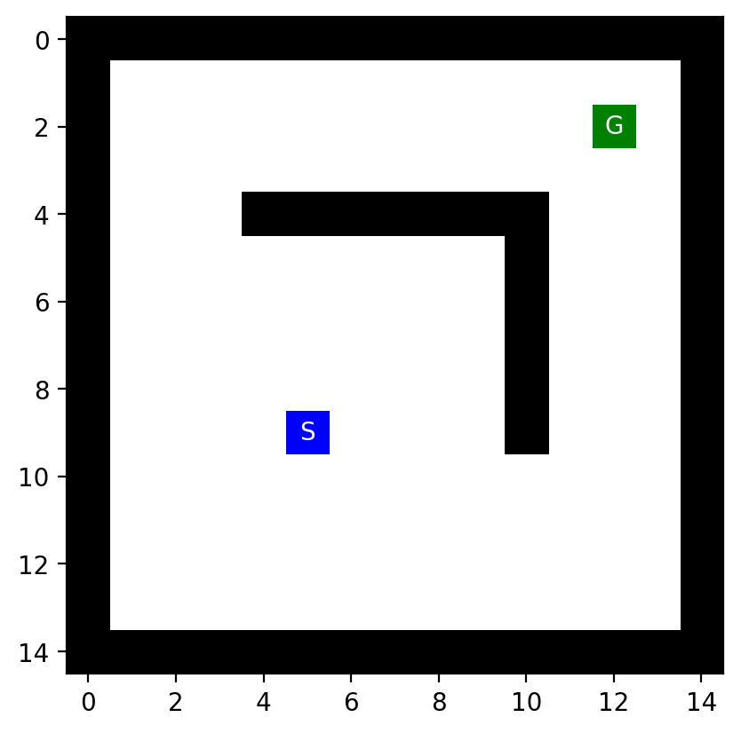
    


## Implementation

My implementation follows the pseudo code from the slides/textbook.


```python
# tree_search_solution.py has my actual implementation (not published)
import tree_search_solution as ts


# order in which we add new states to the frontier
ts.set_order("NESW")
#ts.set_order(random=True)
```

    Directions are checked in the order ['N', 'E', 'S', 'W']
    Directions are checked in the order ['N', 'E', 'S', 'W']
    

## Experiments

### BFS


```python
ts.set_order("NESW")
#ts.set_order(random=True)

%time result = ts.best_first_search(maze, strategy = "BFS", debug = False, vis = False)
ts.show_path(maze, result)
result['actions']
```

    Directions are checked in the order ['N', 'E', 'S', 'W']
    CPU times: user 1.77 ms, sys: 0 ns, total: 1.77 ms
    Wall time: 1.66 ms
    Path length: 16
    Reached squares: 151
    


    
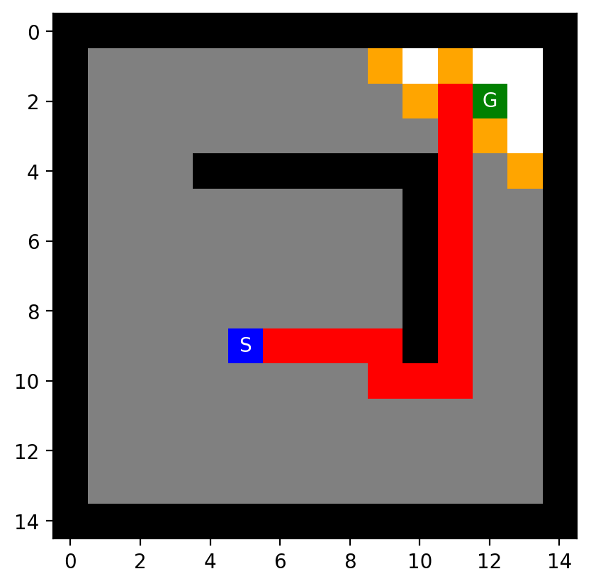
    


    ['E',
     'E',
     'E',
     'E',
     'S',
     'E',
     'E',
     'N',
     'N',
     'N',
     'N',
     'N',
     'N',
     'N',
     'N',
     'E']


### DFS 

This implementation uses not reached data structure and has space complexity $O(bm)$ instead of $O(b^m)$ when we reuse the tree search algorithm from BFS!

We need to check for all cycles. If we do not break all cycles correctly, then we will end up in an infinite loop. Here are possible solutions:
* Stop after a fixed number of tries and return no solution `max_tries`.
* IDS solves this problem.

Note on the visualization: I use gray for areas that the algorithm has explored, but DFS has already removed it from memory!


```python
# Note: DFS uses LIFO so the directions come from the stack in reverse order!

# Can get stuck for empty maze since cycle checking is not string enough! 
# I use a maximum number of tries and stop if the goal is not reached.
ts.set_order("NESW")
#ts.set_order("SENW")
#ts.set_order("WSEN")
#ts.set_order(random=True)

%time result = ts.DFS(maze, vis = False, max_tries = 100000, debug_reached = True)

#result
ts.show_path(maze, result)
if result['path'] is None:
    print("No solution found!")
```

    Directions are checked in the order ['N', 'E', 'S', 'W']
    CPU times: user 2.36 ms, sys: 386 μs, total: 2.75 ms
    Wall time: 2.58 ms
    Path length: 122
    Reached squares: 145
    


    
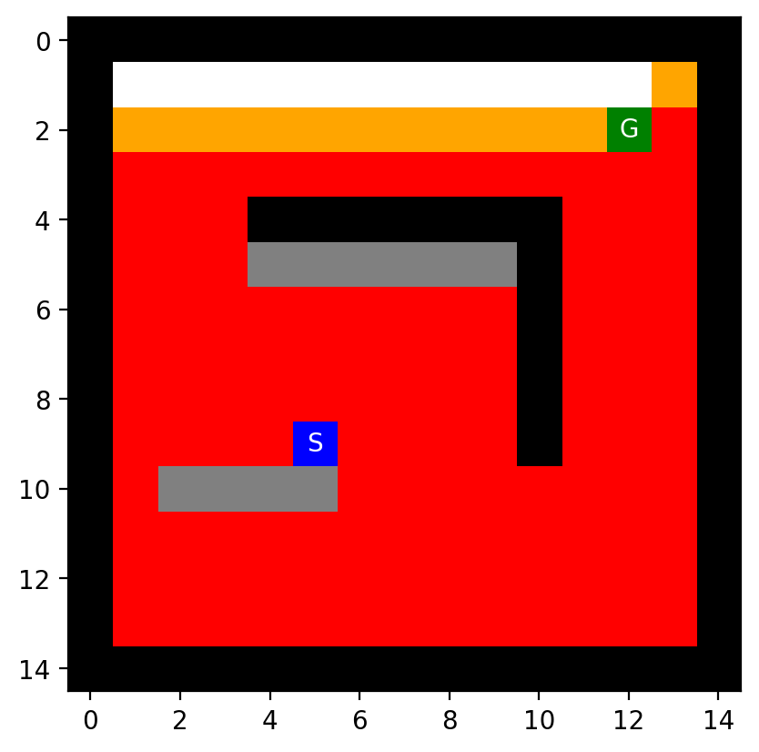
    


Do the same, but change the order in which we explore states (add them to them as nodes to the frontier).


```python
#ts.set_order("NESW")
ts.set_order("SENW")
#ts.set_order("WSEN")
#ts.set_order(random=True)

%time result = ts.DFS(maze, vis = False, max_tries = 100000, debug_reached = True)

#result
ts.show_path(maze, result)
if result['path'] is None:
    print("No solution found!")
```

    Directions are checked in the order ['S', 'E', 'N', 'W']
    CPU times: user 544 μs, sys: 0 ns, total: 544 μs
    Wall time: 550 μs
    Path length: 26
    Reached squares: 53
    


    
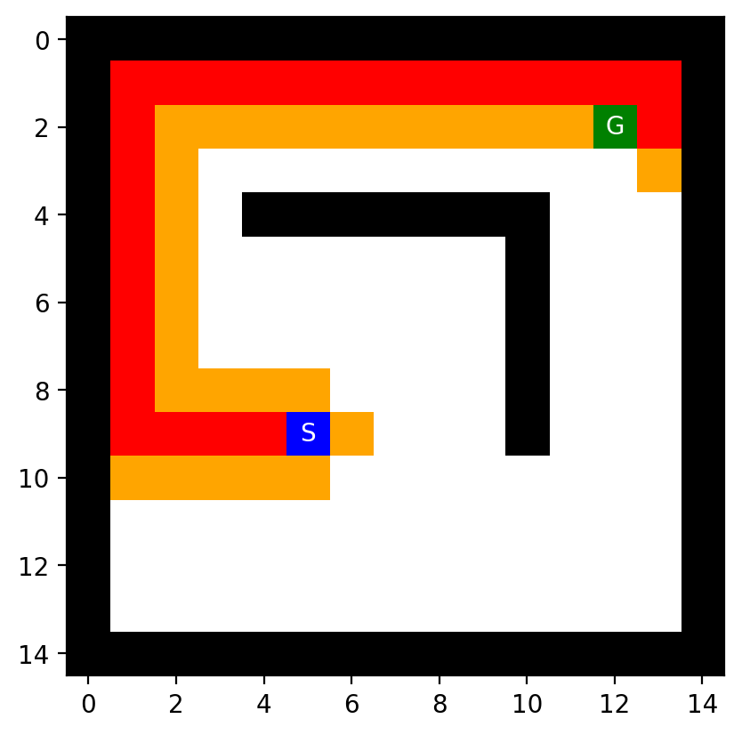
    


We could do a random walk and not check for cycles. This is guaranteed to reach eventually any square including the goal, 
but creates a long path. The path could be simplified leading to the [Tremaux's algorithm](https://en.wikipedia.org/wiki/Maze_solving_algorithm).


```python
ts.set_order(random = True)

# run it multiple times to see the effect of randomization
for _ in range(5):
    %time result = ts.DFS(maze, check_cycle = False, max_tries = 100000, vis = False, debug_reached = True)

    #result
    ts.show_path(maze, result)
    if result['path'] is None:
        print("No solution found!")
```

    Directions are checked at every step in random order.
    CPU times: user 40 ms, sys: 0 ns, total: 40 ms
    Wall time: 52.4 ms
    Path length: 1550
    Reached squares: 125
    


    
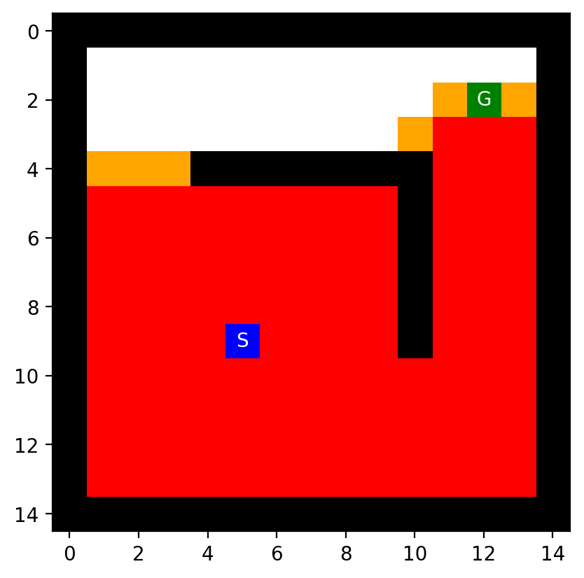
    


    CPU times: user 7.77 ms, sys: 0 ns, total: 7.77 ms
    Wall time: 7.77 ms
    Path length: 482
    Reached squares: 119
    


    
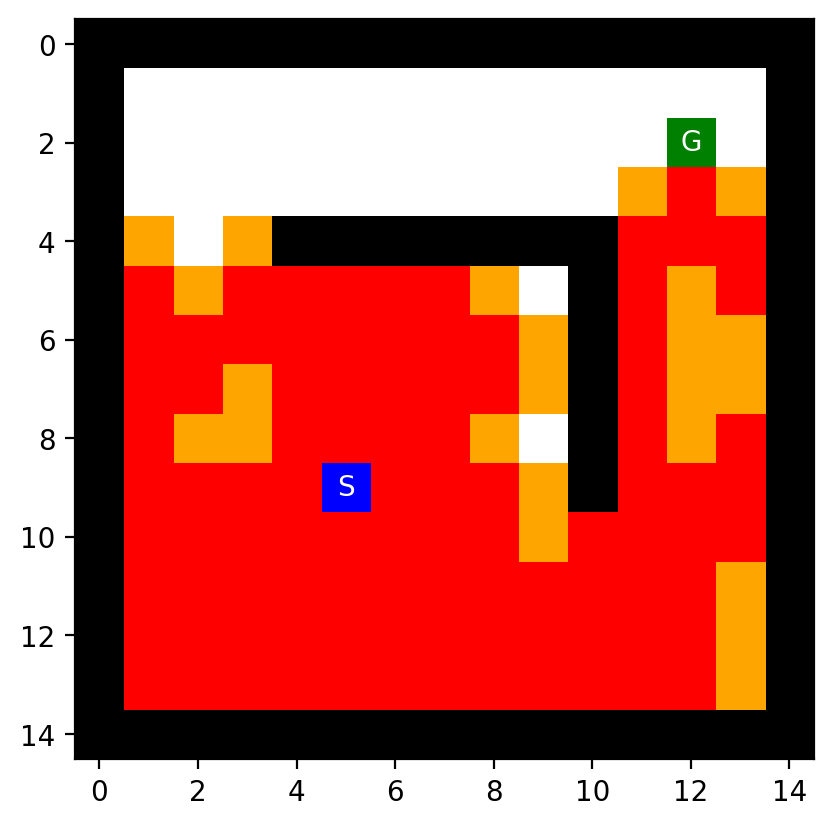
    


    CPU times: user 2.74 ms, sys: 0 ns, total: 2.74 ms
    Wall time: 2.76 ms
    Path length: 188
    Reached squares: 102
    


    
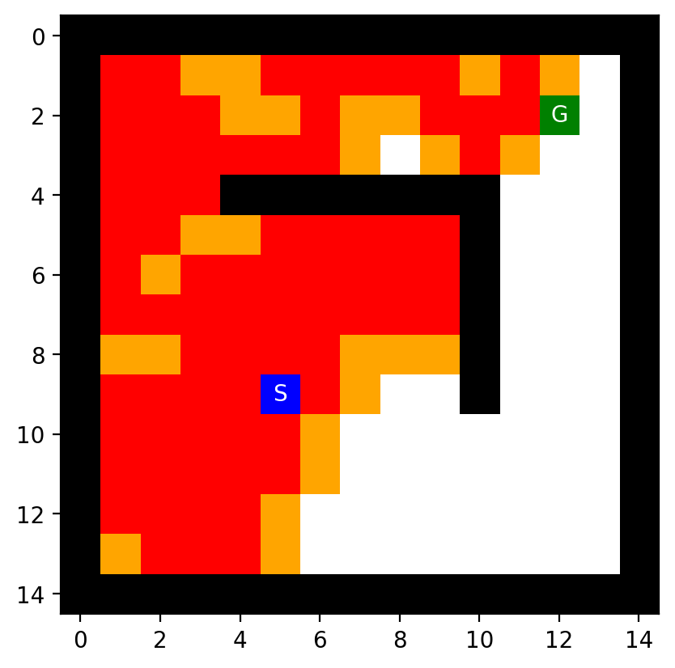
    


    CPU times: user 6.04 ms, sys: 0 ns, total: 6.04 ms
    Wall time: 5.88 ms
    Path length: 300
    Reached squares: 121
    


    
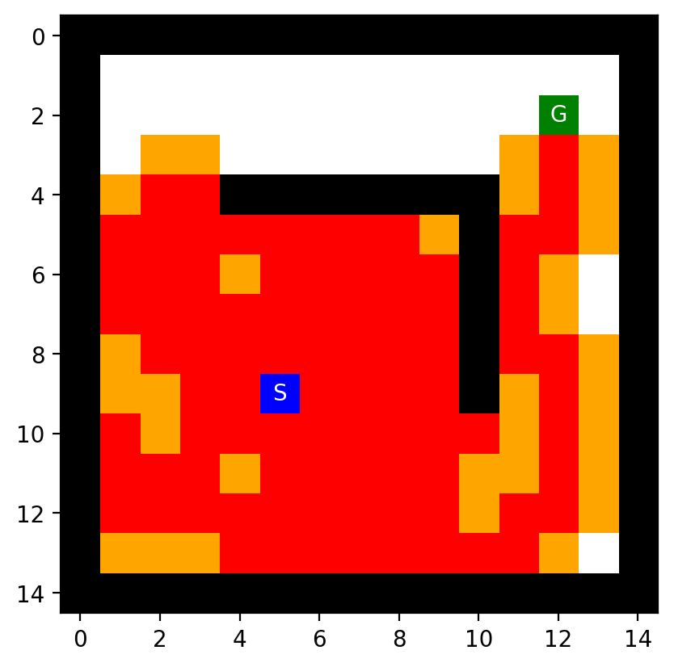
    


    CPU times: user 12.6 ms, sys: 25 μs, total: 12.6 ms
    Wall time: 12.6 ms
    Path length: 666
    Reached squares: 138
    


    
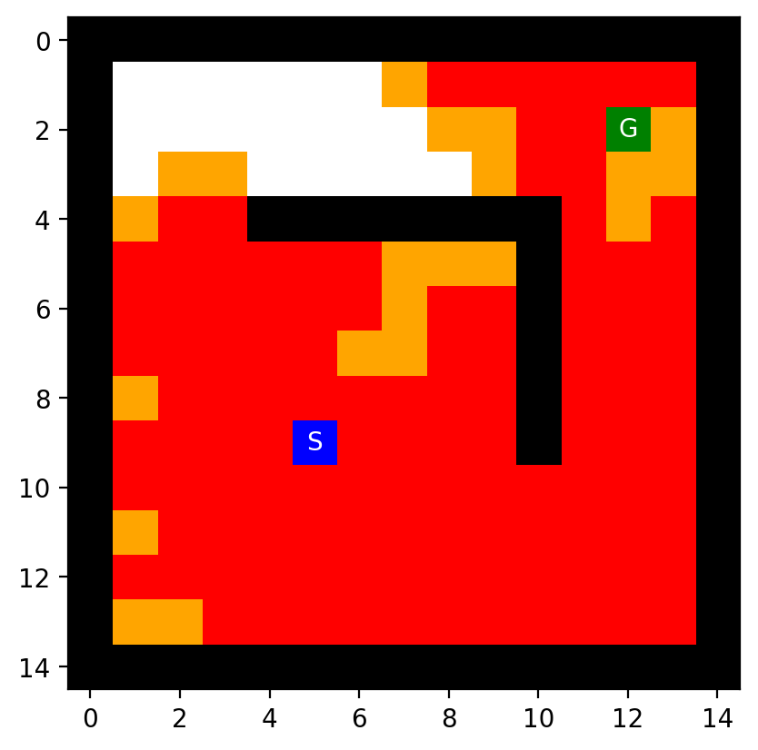
    


### Run randomized DFS multiple times and use the best solution.

__Note:__ IDS takes a similar amount of time and memory, but is guaranteed optimal.


```python
ts.set_order(random = True)

N = 100
%time results = [ ts.DFS(maze, max_tries = 10000, vis = False) for _ in range(N) ]

# check if we found a solution and display the best solution
results = [ r for r in results if not r['path'] is None ]
if len(results) > 0:
    path_lengths = [ len(r['path'])-1 for r in results ]

    print(f"Solutions have path_lengths of {path_lengths}")

    result = results[ts.min_index(path_lengths)]
    ts.show_path(maze, result)
else:
    print("No solution found!")
```

    Directions are checked at every step in random order.
    CPU times: user 185 ms, sys: 0 ns, total: 185 ms
    Wall time: 184 ms
    Solutions have path_lengths of [62, 64, 54, 54, 94, 50, 32, 42, 38, 38, 60, 86, 38, 58, 62, 42, 104, 58, 54, 36, 90, 66, 58, 74, 90, 52, 46, 60, 68, 86, 100, 84, 50, 66, 56, 64, 58, 76, 66, 42, 76, 70, 74, 42, 102, 68, 80, 64, 76, 66, 46, 66, 70, 36, 56, 54, 66, 48, 98, 40, 108, 52, 78, 52, 66, 64, 30, 72, 72, 56, 98, 60, 48, 84, 52, 78, 80, 42, 64, 92, 112, 58, 50, 76, 70, 46, 58, 82, 74, 52, 110, 58, 44, 86, 58, 66, 38, 74, 30, 56]
    Path length: 30
    Reached squares: 0
    


    
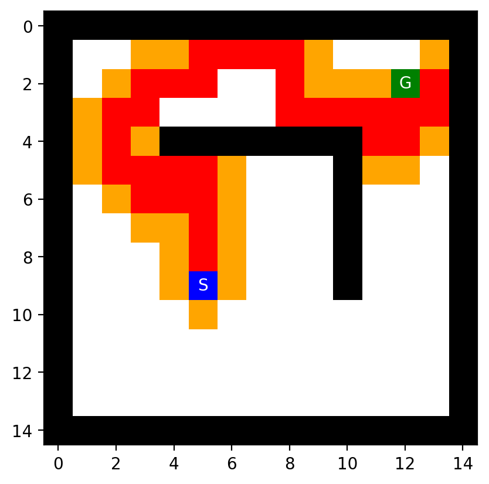
    


### Depth limited DFS

Note: The frontier needs to be checked differently during cycle checking!


```python
ts.set_order(random = True)

%time result = ts.DFS(maze, limit = 5, frontier_option = 2, max_tries = 100000, vis = False, debug_reached = True)
ts.show_path(maze, result)
```

    Directions are checked at every step in random order.
    CPU times: user 1.97 ms, sys: 0 ns, total: 1.97 ms
    Wall time: 1.98 ms
    Reached squares: 57
    


    
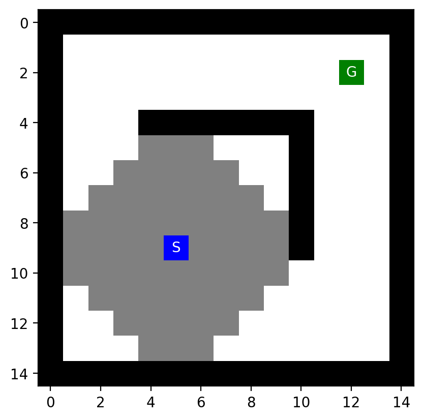
    


### IDS

__Notes:__ 

* IDS with DFS does not store reached squares, so gray areas are not shown!

* IDS depends on the cycle checking of DFS and therefore is also affected by these problems.


```python
ts.set_order(random = True)

%time result = ts.IDS(maze, frontier_option = 2, max_tries = 100000)
ts.show_path(maze, result)
```

    Directions are checked at every step in random order.
    CPU times: user 2.55 s, sys: 17.8 ms, total: 2.57 s
    Wall time: 2.57 s
    Path length: 16
    Reached squares: 0
    


    
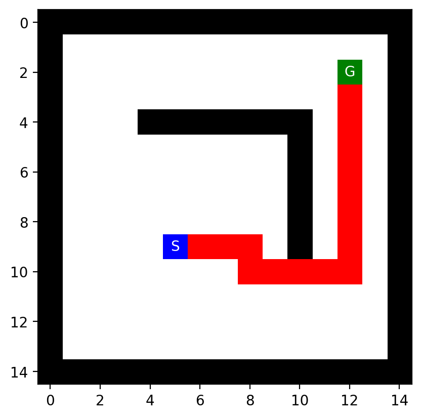
    


### Greedy Best-First Search (GBFS)


```python
# set the heuristic to Manhattan distance
ts.heuristic = ts.manhattan
```


```python
ts.set_order(random=True)

%time result = ts.best_first_search(maze, strategy = "GBFS", debug = False, vis = False)
ts.show_path(maze, result)
```

    Directions are checked at every step in random order.
    CPU times: user 1.21 ms, sys: 119 μs, total: 1.33 ms
    Wall time: 1.33 ms
    Path length: 22
    Reached squares: 61
    


    
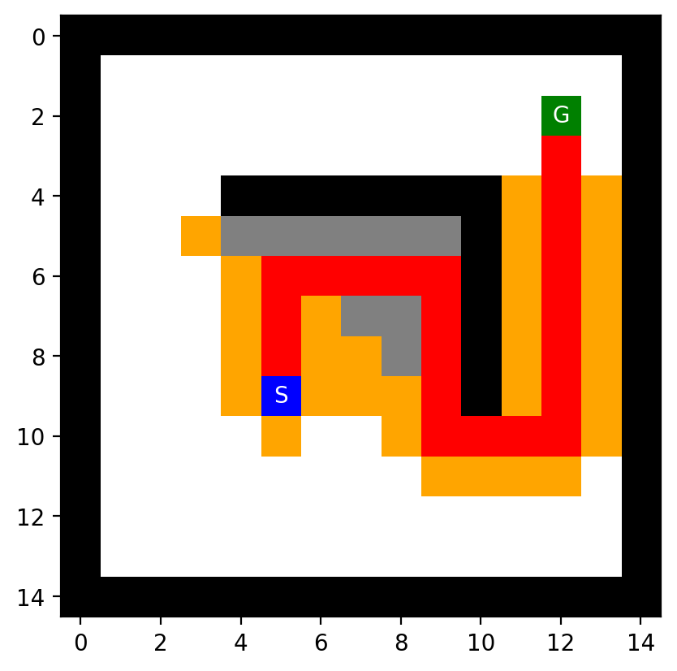
    


### A* Search


```python
ts.set_order(random=True)

%time result = ts.best_first_search(maze, strategy = "A*", debug = False, vis = False)
ts.show_path(maze, result)
```

    Directions are checked at every step in random order.
    CPU times: user 1.49 ms, sys: 144 μs, total: 1.63 ms
    Wall time: 1.63 ms
    Path length: 16
    Reached squares: 67
    


    
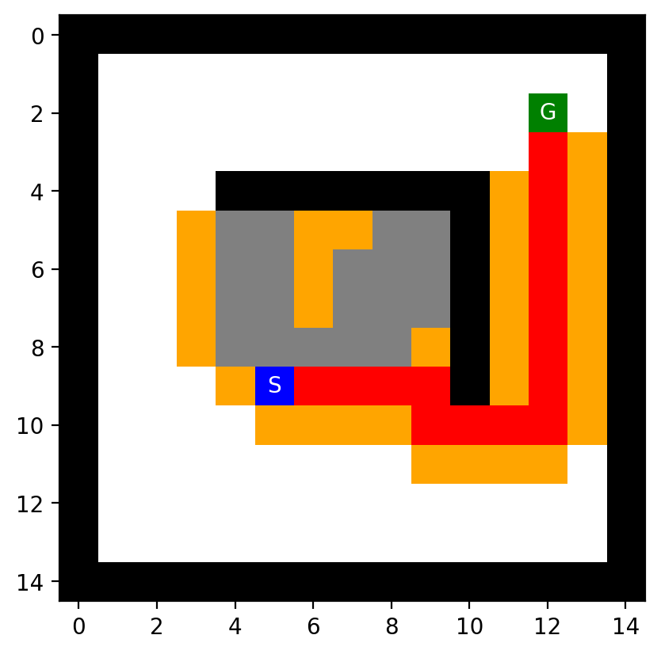
    


### Weighted A* Search

$W > 1$ tends towards GBFS (optimality is not guaranteed)


```python
ts.set_order(random=True)

%time result = ts.best_first_search(maze, strategy = "A*", W = 1+1e-9, debug = False, vis = False)
ts.show_path(maze, result)
```

    Directions are checked at every step in random order.
    CPU times: user 1.6 ms, sys: 154 μs, total: 1.75 ms
    Wall time: 1.75 ms
    Path length: 16
    Reached squares: 61
    


    
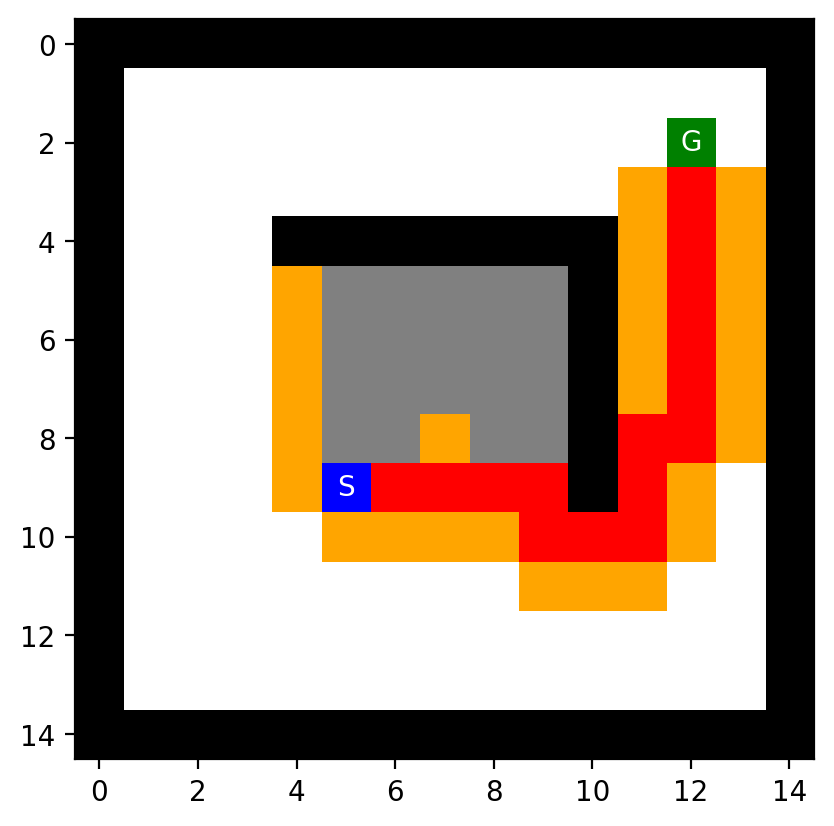
    


```python
%time result = ts.best_first_search(maze, strategy = "A*", W = 5, debug = False, vis = False)
ts.show_path(maze, result)
```

    CPU times: user 1.85 ms, sys: 179 μs, total: 2.03 ms
    Wall time: 2.07 ms
    Path length: 18
    Reached squares: 59
    


    
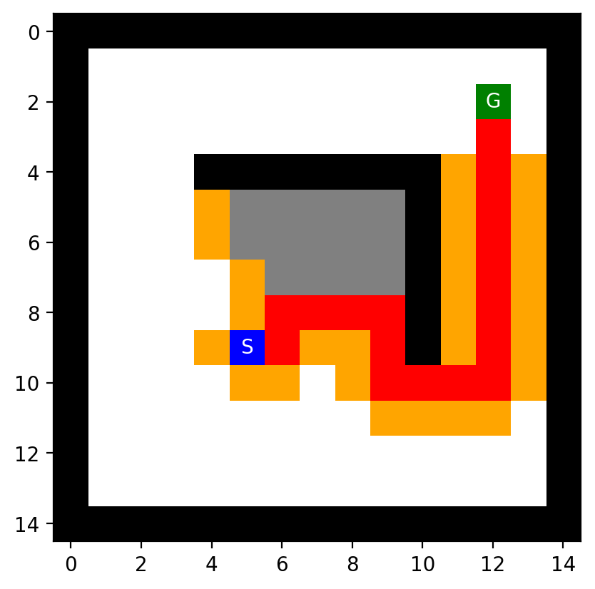
    


```python
%time result = ts.best_first_search(maze, strategy = "A*", W = 1000, debug = False, vis = False)
ts.show_path(maze, result)
```

    CPU times: user 1.33 ms, sys: 0 ns, total: 1.33 ms
    Wall time: 1.35 ms
    Path length: 16
    Reached squares: 56
    


    
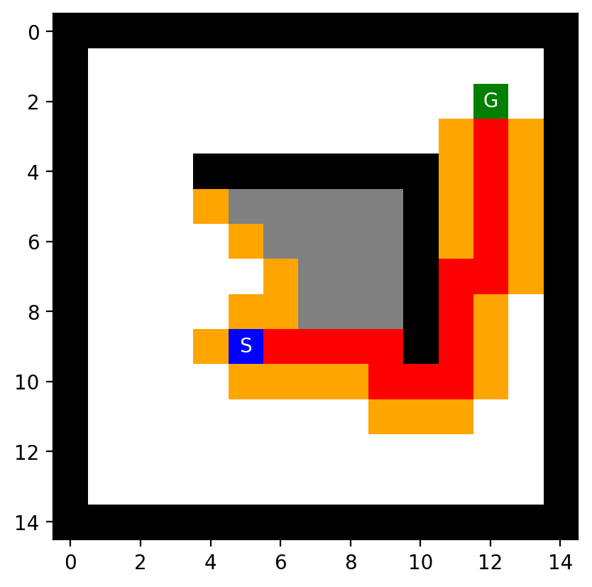
    


$W<1$ tends towards Uniform-Cost Search/BFS (optimality is guaranteed)


```python
%time result = ts.best_first_search(maze, strategy = "A*", W = .7, debug = False, vis = False)
ts.show_path(maze, result)
```

    CPU times: user 13.1 ms, sys: 87 μs, total: 13.2 ms
    Wall time: 12.1 ms
    Path length: 16
    Reached squares: 113
    


    
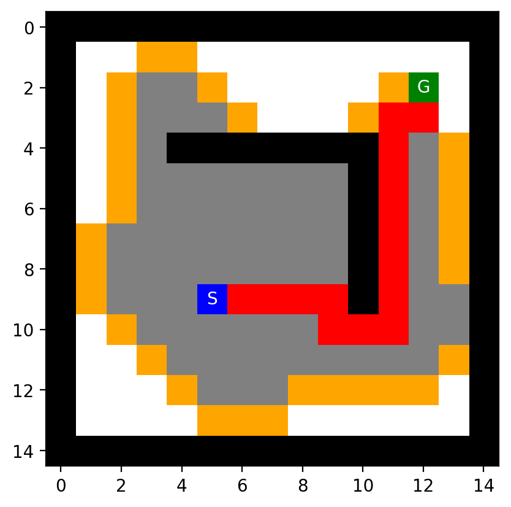
    


```python
%time result = ts.best_first_search(maze, strategy = "A*", W = .0001, debug = False, vis = False)
ts.show_path(maze, result)
```

    CPU times: user 12.4 ms, sys: 14 μs, total: 12.4 ms
    Wall time: 12.2 ms
    Path length: 16
    Reached squares: 150
    


    
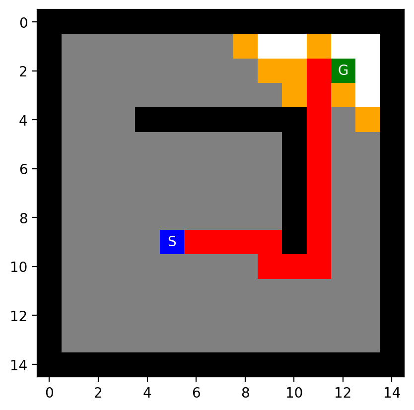
    


### Compare Timing


```python
#f = open("small_maze.txt", "r")
#f = open("medium_maze.txt", "r")
f = open("large_maze.txt", "r")    # this has only one solution!
#f = open("open_maze.txt", "r")
#f = open("empty_maze.txt", "r")
#f = open("empty_maze_2.txt", "r")
#f = open("L_maze.txt", "r")
#f = open("loops_maze.txt", "r")

maze_str = f.read()
maze = parse_maze(maze_str)

ts.show_maze(maze)

ts.set_order(random=True)

```


    
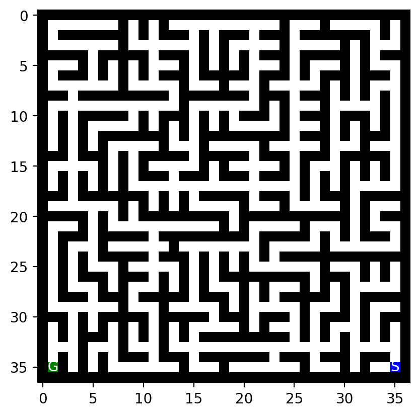
    


    Directions are checked at every step in random order.
    


```python
import timeit
import math

reps = 10

times = {}

algorithms = ["BFS", "DFS", "GBFS", "A*"]

### FIXME: add IDS

for a in algorithms:
    times[a] = math.ceil(timeit.timeit(stmt = f'ts.best_first_search(maze, strategy = "{a}", debug = False, vis = False)', 
              setup = 'from __main__ import ts, maze',
                    number = reps)*1e6/reps)
    
times['DFS(no reached)'] = math.ceil(timeit.timeit(stmt = f'ts.DFS(maze, vis = False)', 
              setup = 'from __main__ import ts, maze',
                    number = reps)*1e6/reps)

times['IDS'] = math.ceil(timeit.timeit(stmt = f'ts.IDS(maze, vis = False)', 
              setup = 'from __main__ import ts, maze',
                    number = reps)*1e6/reps)
```


```python
import pandas as pd
df = pd.DataFrame(times, index = ["time in micro seconds"])
df
```


<div>
<style scoped>
    .dataframe tbody tr th:only-of-type {
        vertical-align: middle;
    }

    .dataframe tbody tr th {
        vertical-align: top;
    }

    .dataframe thead th {
        text-align: right;
    }
</style>
<table border="1" class="dataframe">
  <thead>
    <tr style="text-align: right;">
      <th></th>
      <th>BFS</th>
      <th>DFS</th>
      <th>GBFS</th>
      <th>A*</th>
      <th>DFS(no reached)</th>
      <th>IDS</th>
    </tr>
  </thead>
  <tbody>
    <tr>
      <th>time in micro seconds</th>
      <td>8128</td>
      <td>3758</td>
      <td>10072</td>
      <td>11679</td>
      <td>9134</td>
      <td>1129534</td>
    </tr>
  </tbody>
</table>
</div>


```python
import matplotlib.pyplot as plt

plt.bar(df.columns, height = df.iloc[0])
plt.ylabel("run time in micro seconds")
plt.show()
```


    
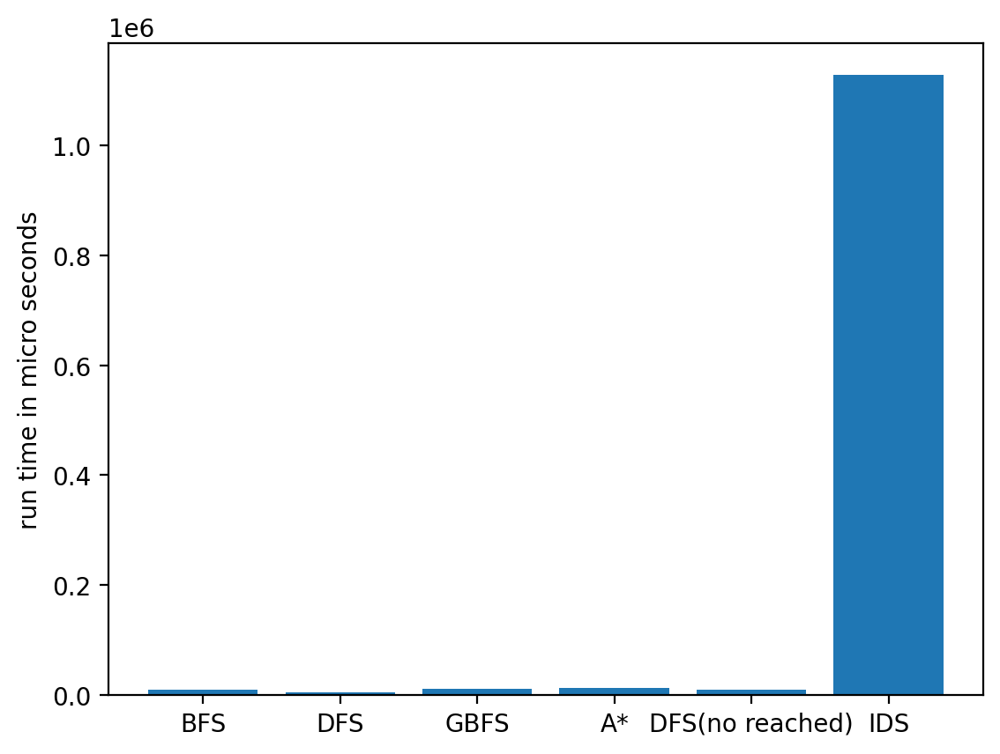
    

